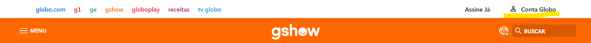

#   Questão:
Tira um print de alguma seção de uma página web na qual você tenha identificado o possível uso do JavaScript para implementar uma funcionalidadeatravés da interação do usuário(em outraspalavras, algo que não daria para fazer apenas com HTML e CSS).

## Resolução:
 Na imagem acima acredito que há um uso do javaScript na parte marcada devido a interação direta com o usuário. Pois como visto no curso, javaScript é a parte "dinâmica" do site.