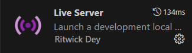

#   Questão:
Pesquise sobre alguma extensão do VSCodeque seja interessante para usar com os conceitos e ferramentas vistos até o momento, e explique porque escolheu ela. Idealmente, procure extensões para facilitar ou automatizar a escrita de arquivos HTML e CSS, porém, pode considerar também o desenvolvimentos de projetos web com VSCode de forma geral, ou a escrita de arquivos JavaScript se se sentir à vontade.

## Resolução:
 A extensão Live Server cria um servidor local para hospedar o projeto e atualizar a página de forma automatica, sempre que houver alterações no código.